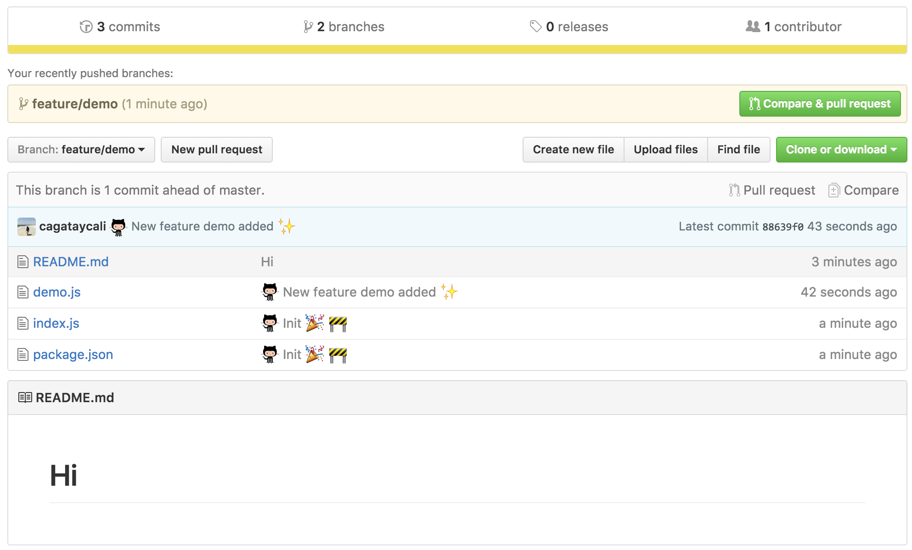

<h3 align="center">
  
</h3>
<h4 align="center">
  Git is easy, github cli is easy but <b>g3l</b> easiest git cli in the w0rld!
</h4>
<p align="center">
    <a href="https://g3l.download">Checkout new website!</a>
</p>

------------------

[](https://www.gitcheese.com/app/#/projects/4ecb1219-b5ab-494d-a93d-f06b8035d2f2/pledges/create)

[](https://www.npmjs.com/package/g3l)[](https://www.npmjs.com/package/g3l)[](https://david-dm.org/svtek/g3l.svg)
[]()
[]()
<!-- [](https://nodei.co/npm/g3l/) -->


# Introduction

    Nowadays, developers are leaving bulky tools, rather
    they use simpler and faster tools.

    Like java based IDE's instead of html based IDE's. (IDE*)

    To give an example WebStorm instead of Atom for web development.

    Both of them are insane but I prefer Atom because is faster than the other.

    We are code ninjas! We don't need bulky gui's.
    We can use terminal as swiss army knife!

    That's the reason, I don't want to use git clients like as SourceTree.


<i>IDE: Integrated development environment</i>

# Motivation

    Did you bored white-black terminal when using git?

    Want auto commit your changes like as bulky IDE's doing?

    Copy paste your bash script into your new baby computer .zshrc / .bashrc file.

<p align="center">
You don't have to do this. <b>DONT DO THAT</b> !
It's not acceptable. :hand:
</p>


# Dependencies

> g3l written in node.js. Node depends on  JavaScript on a VM that is incredibly fast (V8). It is much faster than Ruby, Python, or Perl.
That's the reason you have to install node.
[Download node.js](https://nodejs.org/en/download/)

# Installing

> After you download node you can use command in your terminal called "npm", npm is a package manager for node.

```
npm i g3l -g
```

> Note: g3l auto committer needs .gitignore file.

# Usage
| Short | Full | Description | Params | Example usage | Known issues |
|-------|--------------|----------------------------------------------------------|--------|---------------------------|-----------------------------------------------------------------------|
| -h | --help | Outputs list of commands and usage. | - | g3l -h | - |
| -m | --message | Commit your changes on git then push your current branch | string | g3l -m "Hello world" | - |
| -b | --new_branch | Change your current branch. | string | g3l -b awesome/branchName | This command only create new branch. |
| -p | --publish | Npm version bump and npm publish. | - | g3l -p | This command doing version bump with npm publish. |
| -i | --init | Git init current directory. | - | g3l -i | - |
| -s | --status | Git status current directory. | - | g3l -s | - |
| -c | --create | Create GitHub repository instant. | - | g3l -c | Two factor logins doesn't supporting, creates only GitHub repository. |
| - | --clone | Clone any git repository. | - | g3l --clone | - |
| -u | --update | Self update, g3l. | - | g3l -u | - |
| -e | --enable | Enable auto committer for current directory. | - | g3l -e | - |
| -d | --disable | Disable auto committer for current directory. | - | g3l -d | - |

### Example chain : 
```
g3l -m "New branch for bug fix" -b fix/notBugItsFeature
```

# Feature          
+ Instant commit and push process.
+ Create GitHub repository in cli.
+ Your commit message filtered smart algorithm then dress up with emojis. (Not enough smart yet. Like me :smile:)
+ g3l watch your working directory and when you change something, g3l commit changed files insantly. You will be native notified when committing done.

<p align="right"><a href="#top">I'm done, I'll download. :clap:</a></p>

# Upgrade

If you want upgrade your version type like these

```
npm i -g g3l
```



## If you can't see emojis
### Manual install on any Linux
Install for the current user without root:
```sh
# 1. Download the latest version
wget https://github.com/eosrei/emojione-color-font/releases/download/v1.3/EmojiOneColor-SVGinOT-Linux-1.3.tar.gz
# 2. Uncompress the file
tar zxf EmojiOneColor-SVGinOT-Linux-1.3.tar.gz
# 3. Run the installer
cd EmojiOneColor-SVGinOT-Linux-1.3
./install.sh
```

### Install on Ubuntu Linux
Launchpad PPA: https://launchpad.net/~eosrei/+archive/ubuntu/fonts

```sh
sudo apt-add-repository ppa:eosrei/fonts
sudo apt-get update
sudo apt-get install fonts-emojione-svginot
```

Useful: [Emojione Picker for Ubuntu][13]
[13]: https://github.com/gentakojima/emojione-picker-ubuntu

### Install on Arch Linux
AUR package: https://aur.archlinux.org/packages/emojione-color-font/

```sh
yaourt -S emojione-color-font
```

### Install on Gentoo Linux
Gentoo repository: https://github.com/jorgicio/jorgicio-gentoo

```sh
# Install layman using Portage with USE="git" enabled, the default.
emerge layman
# Add the repo.
layman -s jorgicio
# Install the package.
emerge emojione-color-font
```

## Install on OS X
There are three install options for OS X. Both SVGinOT versions are available
from releases: https://github.com/eosrei/emojione-color-font/releases

1. `EmojiOneColor-SVGinOT-1.3.zip` - The regular version of the font
   installs like any other font and can be specifically selected, but OS X will
   default to the `Apple Color Emoji` font for emojis.
2. ` EmojiOneColor-SVGinOT-OSX-1.3.zip` - A hack to replace the `Apple
   Color Emoji` font by [using the same internal name][14]. Install and accept
   the warning in Font Book.
3. `emojione-apple.ttf` - A SBIX bitmap Apple-format EmojiOne color font is
   [available in the emojione project][15].

[14]:http://www.macissues.com/2014/11/21/how-to-change-the-default-system-font-in-mac-os-x/
[15]:https://github.com/Ranks/emojione/tree/master/assets/fonts

*Reiterating: Only FireFox supports the SVGinOT color emoji for now. Safari and
Chrome will use the fallback black and white emoji.*

## Install on Windows

There are two install options for Windows. Both SVGinOT versions are available
from releases: https://github.com/eosrei/emojione-color-font/releases

### Standard install

The regular version of the font installs like any other font and can be
specifically selected, but Windows will default to the `Segoe UI Emoji`
font for emoji characters. Download:
https://github.com/eosrei/emojione-color-font/releases/download/v1.3/EmojiOneColor-SVGinOT-1.3.zip

### Replace the default Windows emoji fonts

Windows 7, 8, 10 use emoji from both Segoe UI Symbol and Segoe UI Emoji. We
need to replace both fonts, but keep the existing symbol characters from
Segoe UI Symbol.

This package contains an install script that will generate both fonts (or
in Windows 7, just Segoe UI Symbol) and install them for you. Running the
install script requires both [Python][16] and pip in the PATH.

1. Download the most recent Python 3 for Windows: https://www.python.org/downloads/windows/
2. Start the installer, select "Add Python 3.5 to PATH" and finish the install process.
3. Download EmojiOne Color Windows package from releases:
https://github.com/eosrei/emojione-color-font/releases/download/v1.3/EmojiOneColor-SVGinOT-1.3-Win.zip
4. Uncompress the file.
5. Open the new EmojiOneColor directory.
7. Run install.cmd. *Note: This will take some time.*
8. Install both new fonts when requested.
9. Done!

[16]:https://www.python.org/downloads/windows/

*Reiterating: Only FireFox supports the SVGinOT color emoji for now. IE and
Chrome will use the fallback black and white emoji.*

<i>Added by [Barış Esen](http://github.com/barisesen) :+1: </i>


Maintenance & Development [Çağatay Çalı](http://github.com/cagataycali)

Made with :heart:
