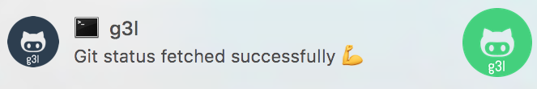
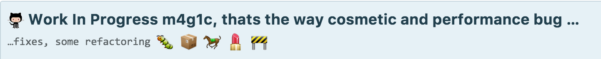
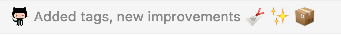
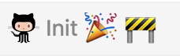
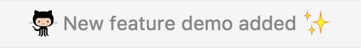

<h3 align="center">
  
</h3>
<h4 align="center">
  Git is easy, github cli is easy but <b>g3l</b> easiest git cli in the w0rld!
</h4>
============

[](https://nodei.co/npm/g3l/)


# Installing

```
npm i g3l -g
```

#  g3l [options]

  Options:

    -h, --help                 output usage information
    -m, --message <message>    Commit message
    -b, --new_branch <branch>  Git push origin as a new branch
    -p, --publish              After process publish repo as a npm package
    -i, --init                 Git init
    -s, --status               Git status
    -c, --create               Create github repository
    --clone                    Clone github repository
    -u, --update               Self update


Looking Cool?

Awesome commits without think which emoji fit well!








Maintenance & Development [Çağatay Çalı](http://github.com/cagataycali)

Made with :heart:
